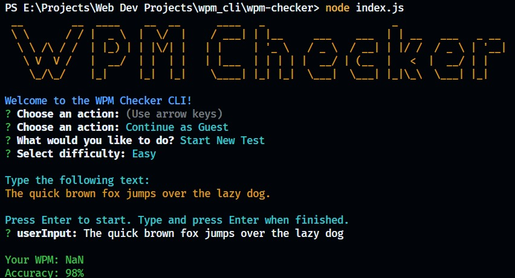

# Command Line Word Per Minute (WPM) Calculator



A command-line based Word Per Minute (WPM) calculator built with Node.js, MongoDB, and JWT for user authentication.

## Features

- **WPM Calculation**: Calculates the user's typing speed based on words typed per minute.
- **MongoDB Integration**: Stores user typing data and history in a MongoDB database.
- **JWT Authentication**: Ensures secure user authentication and data protection.

## Prerequisites

Make sure you have the following installed on your machine:

- [Node.js](https://nodejs.org/)
- [MongoDB](https://www.mongodb.com/)
- [npm](https://www.npmjs.com/) (Node Package Manager)

## Installation

1. Clone the repository:
    ```bash
    git clone https://github.com/sarthak-wiz/wpm_cli.git
    ```
   
2. Navigate to the project directory:
    ```bash
    cd wpm-checker
    ```

3. Install dependencies:
    ```bash
    npm install
    ```

## Running the Application

To run the WPM calculator in development mode:

```bash
npm run dev

node index.js

Environment Variables
Make sure to set the following environment variables:

MONGO_URI: The URI for connecting to your MongoDB database.
JWT_SECRET: A secret key for signing JWT tokens.